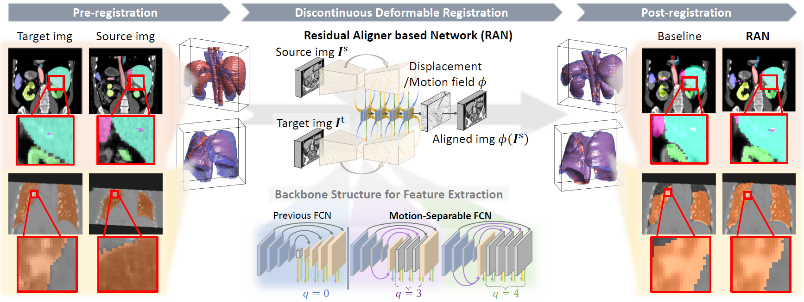

<h1> Residual Aligner-based Network (RAN) for Coarse-to-fine Discontinuous Deformable Registration </h1>

 \| 
 \|

Code for *Medical Image Analysis* paper [Residual Aligner-based Network (RAN): Motion-Aware Structure for Coarse-to-fine Deformable Image Registration](https://doi.org/10.1016/j.media.2023.103038)

> This repo provides an implementation of the training and inference pipeline of RAN based on TensorFlow and Keras. 

---
### Contents ###
- [0. Brief Introduction](#0-brief-intro)
- [1. Installation](#1-installation)
- [2. Usage](#2-usage)
  - [2.1. Training (optional)](#21-training-optional)
  - [2.2. Inference](#22-inference)
- [3. Citing this work](#3-citing-this-work)

---

## 0. Brief Intro ##

